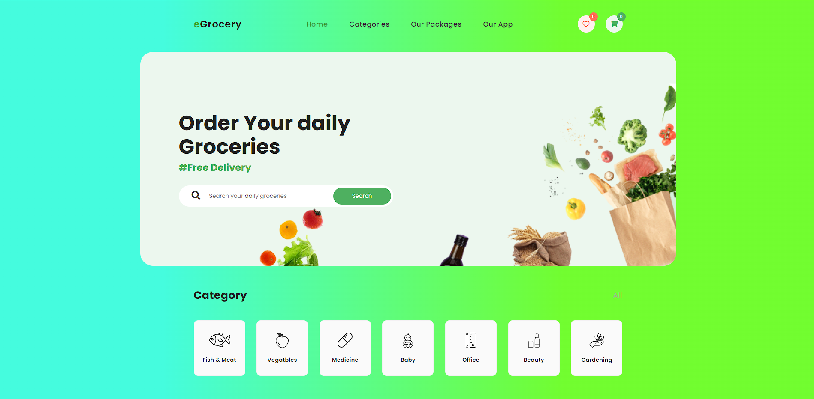
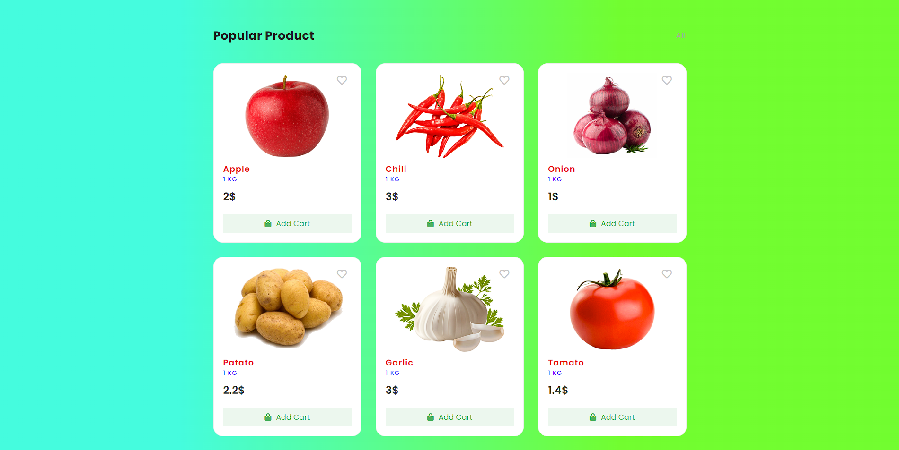
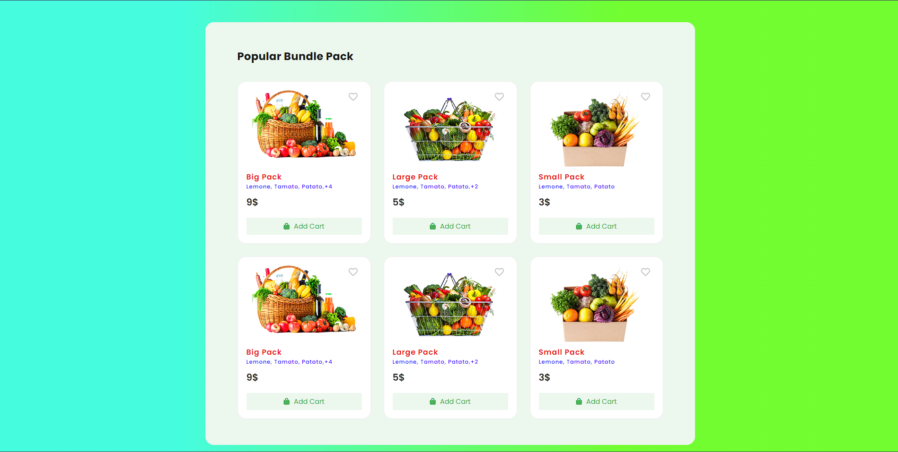
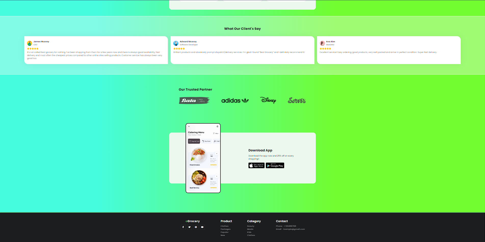

# eGrocery Store - An Grocery store Website

This is a website of an online grocery shopping platform developed using HTML, CSS and JS. This project involves only frontend coding languages. 









## Prerequisites

Before you begin, ensure you have met the following requirements:

* [Git](https://git-scm.com/downloads "Download Git") must be installed on your operating system.

## Installing

For Installation follow these steps:

Linux and macOS:

```bash
sudo git clone https://github.com/khanimran17/Grocery-Store.git
```

Windows:

```bash
git clone https://github.com/khanimran17/Grocery-Store.git
```

